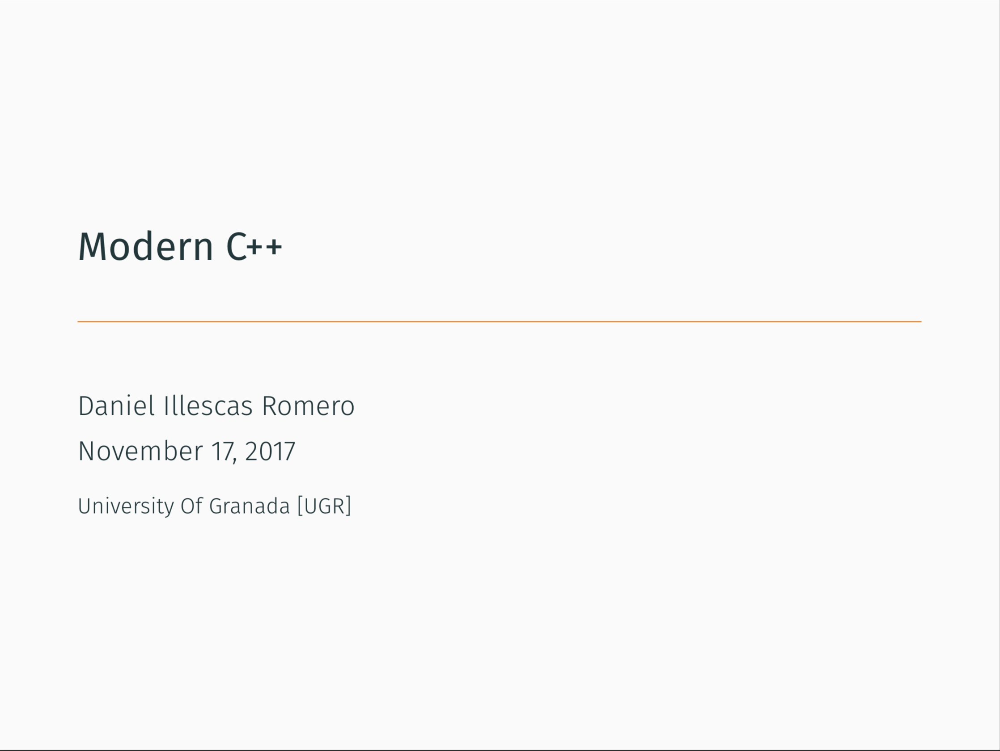
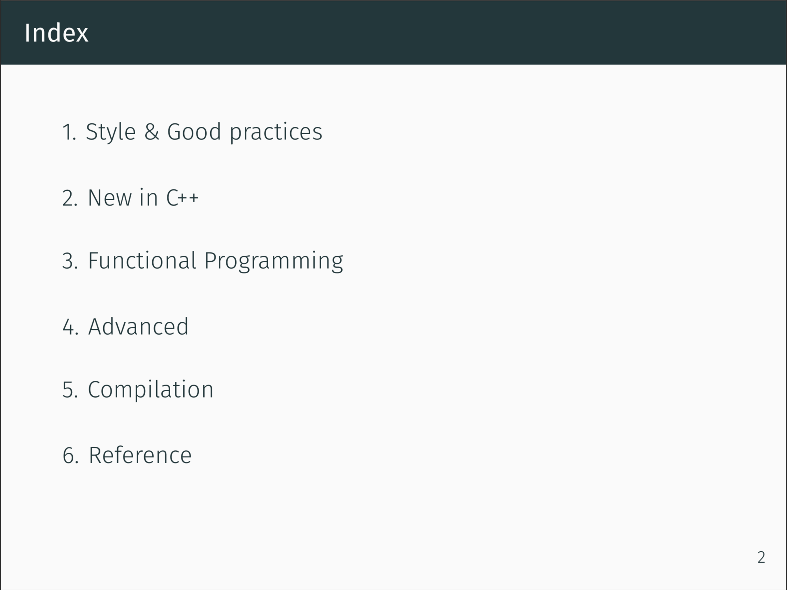
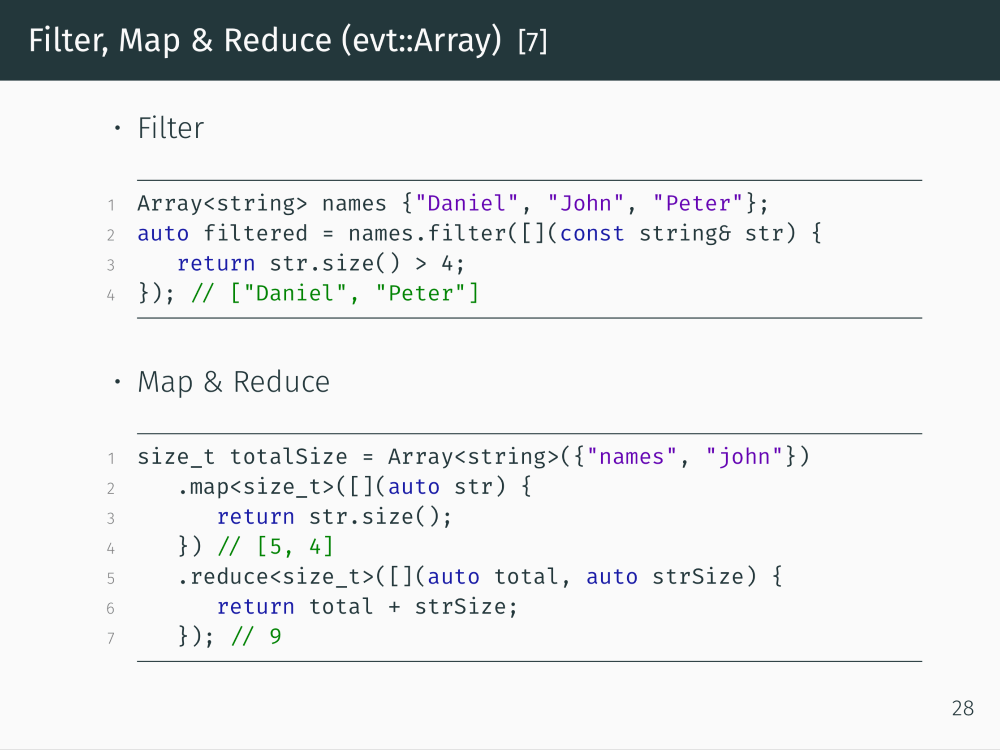

# Modern-Cpp-Slides

Slides about good practices and new c++ content.

Theme used by this presentation: [Metropolis](https://github.com/matze/mtheme)

-> Versión en español: https://github.com/illescasDaniel/Modern-Cpp-Spanish

# [Preview](slides.pdf)

# Download

You can download it in the Releases tab, or [here](https://github.com/illescasDaniel/Modern-Cpp-Slides/releases/download/v1.0/Modern.C.-.Daniel.Illescas.Romero.pdf).

# Compilation

It was compiled with Texpad using LuaLaTex and BibTex for the bibliography.

# License

Anybody has permissions to download, modify or redistribute these slides.

The only requirement is to include the LICENSE file.

More info: https://github.com/illescasDaniel/Modern-Cpp-Slides/blob/master/LICENSE